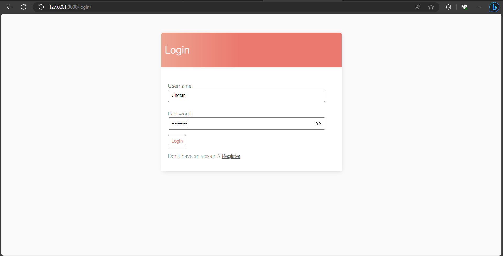

# Django-To-Do-list-with-user-authentication
To Do list app with User Registration, Login, Search and full Create Read Update and DELETE functionality.

How to Run :

pip install Django 

python manage.py runserver 

For TEST :

USER NAME - Chetan 

Password - Kumar@123

Samples :

YES
